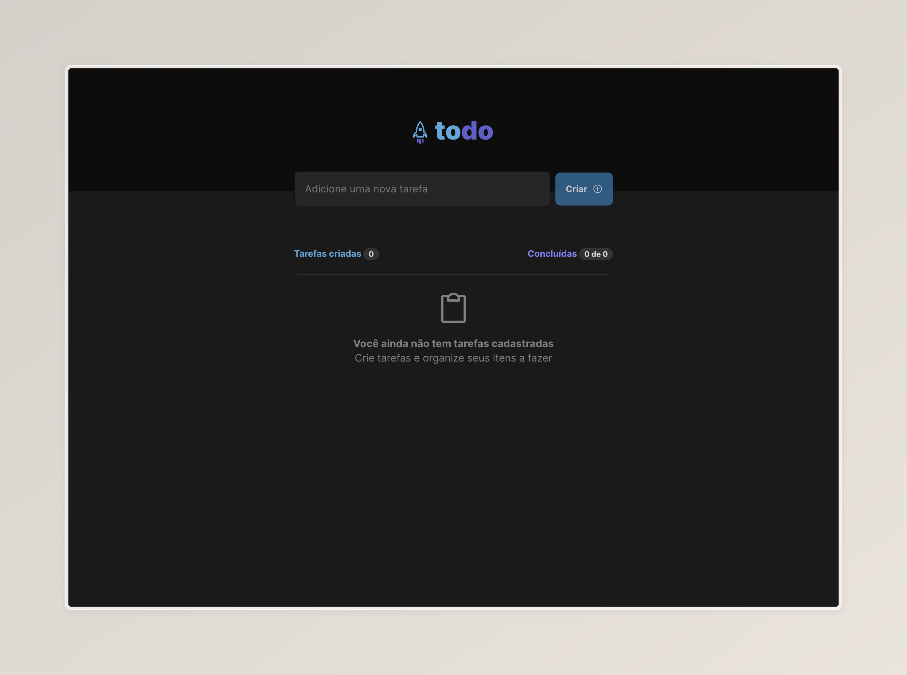
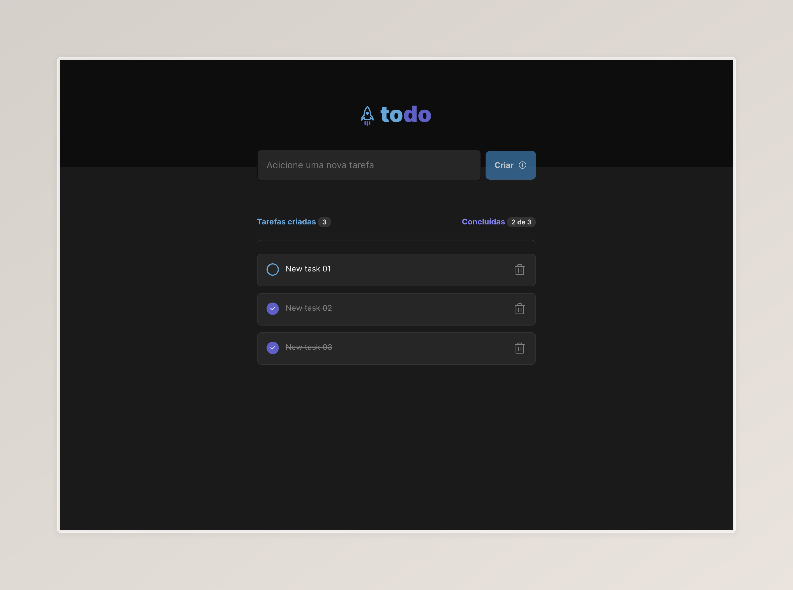

# Ignite To-Do

### Projeto desenvolvido no desafio 01 no curso de ReactJS do Ignite da Rocketseat

## Tecnologias

Esse projeto foi desenvolvido com as seguintes tecnologias:

- [React](https://react.dev/)
- [Css-Modules](/)

## Previews

- Home Page
  

- New Tasks
  

## Layout

É possível visualizar o layout do projeto através [desse link](<https://www.figma.com/file/YnKJryi2auPQuZb6rCgPC6/ToDo-List-%E2%80%A2-Desafio-React-(Copy)?type=design&node-id=0-1&mode=design&t=ZRWVmz9RF8pK1NKt-0>). É necessário possuir uma conta no Figma.

## Instalação

1. git clone https://github.com/RickyHideyukiTakakura/ignite-todo
2. cd ignite-todo
3. npm install ou yarn install

## Projeto

Este é um site para adicionar novas tarefas, marcar como concluídas ou remove-las, o objetivo da criação do projeto é exercitar os conceitos do React,

### Rodar o site na maquina local

#### Para rodar na maquina local:

1. cd rocketfoods-frontend
2. npm run dev
3. acessar o http://localhost:5173/
